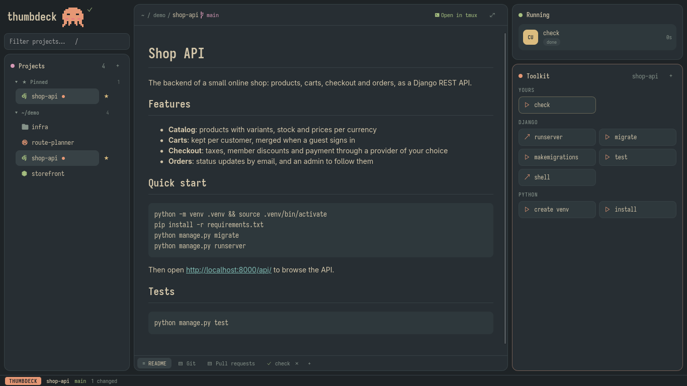

# thumbdeck

**Your projects and their commands, one key away.** A small desktop app for Linux and macOS
(Tauri + Svelte) that sits next to your terminal: pick a project, run its commands, read its
logs, see its git changes and pull requests, and jump into its tmux session when it's time to
write code.



- **Projects** on the left: the git repositories in `~/dev`, `~/projects` and your home folder,
  with their branch and a dot when they have uncommitted changes.
- **The center**: the project's Overview, its README, its tabs (Git, Logs, Agents, Pull
  requests, … from plugins) and the output of what you ran, with a tab for each at the bottom.
  The **Overview** shows where the project stands, in cards: how each Toolkit action ran last,
  and cards from plugins (Git's: the uncommitted files and the last commits). A project opens
  on the tab you showed last in it.
- **Running and Toolkit** on the right: what you started, and buttons for the project's
  commands.
- **Plugins** below the projects: plugins with a view of their own (`Ctrl+p`).
- **The status line** at the bottom: who has the keyboard, the project's branch, and short
  messages.

Everything works from the keyboard, and `?` always lists the keys for where you are. Almost
everything thumbdeck shows comes from [plugins](#plugins).

## Projects and the Toolkit

Every git repository directly inside a scanned folder shows up (**+ › Add folder to scan…** for
more), and **+ › Add project…** adds any folder. Pin the ones you use most (☆), hide the
others (×); hidden projects stay at the bottom, to show again (↺).

The Toolkit's buttons come from plugins that recognise the project: npm / pnpm / yarn scripts,
Makefile targets, Django, Python, Docker Compose, Gradle, Cargo, Go. Press one, or Space then its letter, and it runs as a tab at the
bottom of the center (● running, ✓ done, ✗ failed), its output streaming in. When it ends while
you're in another window, you get a notification. Closing the tab doesn't stop the command;
the Running panel opens it again.

- **Your own actions**: **+** in the Toolkit (or `a`): a name and a command, run in the project
  folder. Tick *Ask before running* for deploys and resets, and *Run in the project's tmux
  session* for servers, watchers and shells.
- **Buttons for a kind of project** thumbdeck doesn't know: a plugin can be just a
  `plugin.toml` saying when it applies and what the buttons run
  ([the guide](https://github.com/Nozeren/thumbdeck-plugins/blob/main/GUIDE.md)).
- Hover a button to see its command; × hides it from this project.

Commands run with your login shell's environment, so tools from Homebrew, fnm or `~/.local/bin`
are found even when thumbdeck is started from a launcher or the Dock.

## tmux

Enter opens the project in your terminal (kitty) in its own tmux session: Neovim in the first
window, a shell in the second, the project's Python venv active in both. Buttons marked ↗ (like
Django's `runserver`) run in a named window of that session instead, and keep running when
thumbdeck closes; pressing one again while it runs doesn't start it twice.

## Plugins

thumbdeck's tabs, Toolkit buttons, panels and views come from plugins, installed in **Settings**
(`,`, or **+ › Settings…**) **› Plugins**: from the [official ones](https://github.com/Nozeren/thumbdeck-plugins),
from any git URL, or from a folder you're working on. The first start offers the official ones.
thumbdeck looks for newer releases of them when it starts, and marks them (↑) in Settings,
where you update them, turn them off, reorder them, or read their log. A plugin runs with your
rights, like an editor plugin: install the ones you trust.

Writing one: the [guide](https://github.com/Nozeren/thumbdeck-plugins/blob/main/GUIDE.md) and
the [spec](https://github.com/Nozeren/thumbdeck-plugins/blob/main/SPEC.md). A plugin can be
just a `plugin.toml` with Toolkit buttons, or add HTML pages (tabs, panels, full-window pages,
a view) that use `window.thumbdeck`, and a backend in any language.

## Tabs

**+** on the strip at the bottom of the center adds a plugin's tab to the project; ⚙ (or `S` in
the tab) changes its setup or removes it. `1`, `2`, … switch tabs, and `z` gives the center the
whole window. The official plugins' tabs:

**Logs**: the project's log files, JSON lines (pino, bunyan, structlog, …) or plain text
(Python, Django, Rust, Go, nginx, …). Show or hide levels, search, jump from error to error,
follow a live tail, open a line's full entry, and fold a log into *sections* (a test, a request,
a deploy step). Its setup says which folders and files to read.

**Agents**: the Claude Code subagents and skills of the project (and yours), each with its
description, model and tools. Pick one, say what it should do, and Enter starts Claude on it in
the project's tmux. The Sessions list shows past Claude Code sessions with their cost, and each
session's conversation, including what its subagents did step by step.

**Pull requests**: the open PRs of the project's GitHub repo that concern you, in the order to
deal with them: asked to review again, asked to review, reviewed, yours. The highlighted one's
checks, conflicts, labels, comments and reviewers show below; 🔔 marks unread notifications.
`v` reviews its changes, `o` opens it in the browser. It uses your `gh` login. Set the repo to
`demo` to try it with sample PRs.

**Git**: the repo at a glance. Uncommitted changes with their diffs, the branch against its
upstream, recent commits, branches and stashes. It only looks; it never changes the repo.

**Env**: the project's `.env` against its `.env.example`: what's missing, empty or still the
example's placeholder. Values stay hidden unless you ask; `a` adds the missing keys.

**Notes**: a scratchpad and checklist for each project, kept by thumbdeck (not in the repo).

Plugins with a **view** of their own are listed below the projects: `Ctrl+p` (or `Ctrl+j`), then Enter, shows
one in the center. **Panels** from plugins sit under the Toolkit. The official views:

- **Calendar**: your calendars' coming events (iCal links) or the whole month (`m`), what's next
  in the pane, reminders.
- **Azure Boards**: your Azure DevOps work items with their details; `y` copies a branch name
  for one. It needs a personal access token (Work Items: Read), kept in a Settings field that
  hides it; set the organization to `demo` to try it.
- **Ports**: what's listening on which port and the project it runs in; `x` stops it (it asks).
- **Clipboard**: what you copied, newest first and searchable; `y` copies one again, `p` pins it.
  Password managers' copies aren't kept.
- **Dev utils**: paste a JWT, JSON, base64, a timestamp or a URL and see it decoded; UUIDs.

## The review page

`v` on a PR, or Enter on the Git tab's changes, a commit or a stash, opens its changes over the
whole window: the changed files on the left, the diff on the right. Side by side or in one
column (`s`), with syntax colours and the words that changed within a line marked.

`n` / `N` jump to the next / previous change, `x` ticks a file as viewed and moves on to the
next (remembered until that file changes again), and `-` moves to the file list, where `j` /
`k` and `l` pick another file. Nothing is checked out for a PR.

## The avatar

A small pixel character next to the title shows what's going on: it cheers when a run
finishes, sighs when one fails, waves when Claude is waiting for you, thinks while Claude
works (with the Agents plugin), holds up a sign when PRs wait for your review (Pull
requests), and sleeps when you're away. Hover it to see why. Click it (or the title) to pick
another: octopus, crab, keycap, ghost, axolotl, or none.

## Keys

`?` lists them wherever you are. The main page is panes, like nvim splits or tmux panes:
Projects and Plugins on the left, the center, Running and Toolkit on the right. The one with
the keyboard has a green border, and its name is at the start of the bottom line.

| key | everywhere |
| --- | --- |
| `Ctrl+h` / `Ctrl+j` / `Ctrl+k` / `Ctrl+l` | the pane to the left / below / above / right (from a plugin's tab too) |
| Space, then a letter | run a Toolkit button (the letters show on the buttons) |
| `1`, `2`, … | the tabs at the bottom: Overview, README, the project's tabs, its runs |
| `Ctrl+b`, then `n` / `p` | the next / previous tab, as in tmux (the keyboard stays where it is) |
| `]` / `[` | next / previous run |
| `a` | add your own action |
| `s` | stop the command shown |
| `z` | expand the center / back |
| `,` | settings: plugins |
| `Ctrl+p` | the Plugins pane |
| Esc | close menus and forms, leave the filter; then back to Projects |

In each pane, `j` / `k` move (`g` / `G`: first / last) and `q` goes back to Projects:

| pane | keys |
| --- | --- |
| Projects | `l` the center · Enter or `o` open the project in tmux · `/` filter (Enter opens the first match) · `p` / `x` pin / hide |
| Plugins | `l` or Enter shows a plugin's view |
| Center: the Overview | `h` / `j` / `k` / `l` between the cards · Enter opens one (Last runs: the Toolkit; Changes: the review; Recent commits: the Git tab) · the card's own keys (`?` lists them) |
| Center: the README, a run's output | `j` / `k` scroll · `d` / `u` half a page |
| Running | `l` or Enter shows its output · `s` stops it |
| Toolkit | Enter runs the button · `e` edits your own action |

A tab you open (or click in) takes the keyboard, and every tab follows the same rules (plugins
that don't aren't loaded):

| key | in every tab |
| --- | --- |
| `j` `k` `g` `G` | move |
| Enter or `l` | open, inside thumbdeck (a log, a conversation, a review) |
| `h` or Backspace | back |
| Tab / Shift+Tab | next / previous list |
| `v` | review the changes |
| `o` | open outside thumbdeck (a PR in the browser) |
| `d` / `u` | scroll the lower part (a diff, details) |
| `r` / `S` / `?` | refresh / set up the tab / its keys |
| Esc or `q` | give the keyboard back to thumbdeck |

## Install

The latest release (Linux x86_64, macOS), in seconds, no build tools needed:

```sh
curl -fsSL https://github.com/Nozeren/thumbdeck-releases/releases/latest/download/install.sh | bash
```

Or from a checkout (needs Node and Rust, see [Develop](#develop)):

```sh
./install.sh             # build this checkout and install it; again after pulling to update
./install.sh --release   # install the latest release instead
```

It installs for your user, without sudo: on Linux to `~/.local/bin`, with a launcher entry and
icon (so it shows up in wofi, rofi or your app menu); on macOS to `~/Applications/thumbdeck.app`.
With [minisign](https://jedisct1.github.io/minisign/) installed, a downloaded release's
signature is checked first.

## Updates

thumbdeck looks for a new release when it starts, and every few hours. When there is one, its
version shows next to the title: click it to see what's new and update. **+ › Check for
updates** asks right away. Releases are signed, and a download that isn't signed with
thumbdeck's key is refused. Builds from source update the same way once a newer release
exists; dev builds never do.

## Develop

Needs Node, Rust (`rustup default stable`) and, on Linux, WebKitGTK (`webkit2gtk-4.1`); on
macOS, the Xcode command line tools (`xcode-select --install`).

```sh
git submodule update --init   # the plugins repo (src-tauri/toolkits), for the tests
npm install
npm run tauri dev             # run with hot reload
npm run tauri build           # build the app
```

Checks: `cd src-tauri && cargo test`, `npm test`, and
`npx svelte-check --tsconfig ./tsconfig.json`.

The plugins repo is checked out in `src-tauri/toolkits` (it isn't compiled in: its tests check
that the official plugins load, and that thumbdeck and `@thumbdeck/check` agree on the keys).
To work on a plugin, link its folder in Settings › Plugins; `THUMBDECK_CATALOG=<file or URL>`
replaces the catalog the first start offers.

### Adding a tab

Tabs are plugins: see the [guide](https://github.com/Nozeren/thumbdeck-plugins/blob/main/GUIDE.md).
thumbdeck's side of plugins is `src-tauri/src/plugins` (manifests, installing, frames, the page
API, backends) and `src/lib/plugins` (frames, setup forms).

### Releasing

```sh
scripts/release.sh 0.4.0          # sets the version, commits, tags v0.4.0
git push origin main v0.4.0       # GitHub Actions builds, signs and publishes it
```

The workflow (`.github/workflows/release.yml`) builds Linux x86_64 and macOS (universal), signs
the builds with the updater key (`~/.tauri/thumbdeck.key`; the public half is
`src-tauri/src/updater.pub`), and publishes them with the `latest.json` apps read to the public
[thumbdeck-releases](https://github.com/Nozeren/thumbdeck-releases) repo. To try an update
before publishing it, point a release build at a local copy:
`THUMBDECK_UPDATE_URL=file:///path/to/latest.json thumbdeck`.
